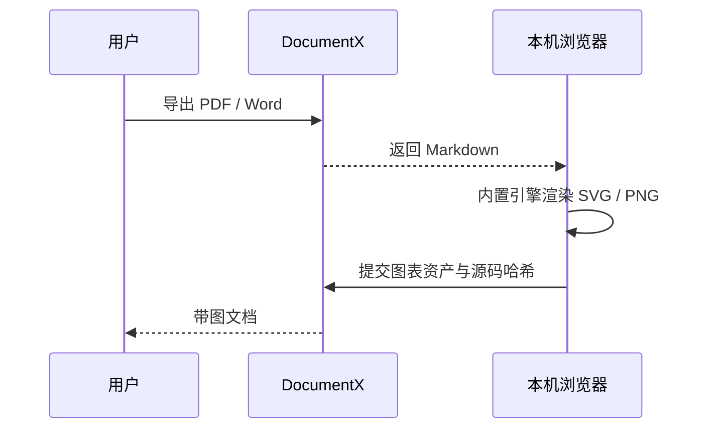

# DocumentX · 文档智能体

一个以网页服务形式对外提供的文档智能体：

- **对外**：网页问答，基于内部知识库回答；可把回答或按模板生成的文档导出为 **Markdown / PDF / Word** 下载。
- **对内**：内容可来自本地目录或 S3 兼容对象存储；`AGENTS.md`、`knowledge/**`、`templates/**` 会在启动时全量载入内存，并定时原子刷新。

## 架构

```
frontend/            前端（Vite + React + TypeScript）
backend/             后端（Rust + Axum）
  src/
    llm.rs           OpenAI Chat Completions 兼容客户端（流式 SSE）
    content.rs       local/S3 内容源、完整内存快照与定时原子刷新
    knowledge.rs     递归目录索引 + Retriever trait + 关键词检索（含中文 bigram）
    templates.rs     模板加载
    render/          Markdown → PDF / Word；图表统一渲染
    api.rs           HTTP 路由 / 中间件
knowledge/           ★ 内部文档（知识库，支持任意层级目录）
templates/           ★ 对外输出模板（每个是一份参考范例 .md）
```

LLM 走 **OpenAI Chat Completions 协议**，`base_url` / `api_key` / `model` 全部可配置——
接 OpenAI 官方、自建网关或第三方模型都可以。

## 依赖

- Rust（stable）
- Node.js 18+

PDF / Word 导出无外部运行服务。PDF 使用**内嵌的 typst 库**，中文字体（Noto Sans SC）已打包进二进制；Word 导出还会把该字体嵌入 DOCX，接收方无需安装中文字体。
所以编译出的可执行文件零依赖，扔进任意 Linux 容器即可运行，无需安装 typst 或系统字体。

Mermaid、Graphviz（WASM）、Vega / Vega-Lite 图表引擎随前端产物打包并按需加载，不请求 CDN 或图表服务。

## 配置

```bash
cp config.example.toml config.toml   # 在仓库根目录，编辑 base_url / api_key / model
# 或用环境变量（见 .env.example），会覆盖 config.toml
```

`config.toml` 的每个字段都有同名的 `DOCUMENTX_*` 环境变量，完整清单见 `.env.example`。环境变量优先于 TOML；旧变量 `LLM_*`、`PORT`、`DIAGRAMS_ENABLED` 仍兼容，但同一字段的 `DOCUMENTX_*` 优先级更高。非法数字或布尔值会在启动时直接报错，不会静默回退。

`server.base_path` 可把整个站点挂到子路径，例如 `/documentx`；页面、静态资源及 API 会分别位于 `/documentx/`、`/documentx/assets/**`、`/documentx/api/**`。配置值会自动补前导 `/`、去掉尾部 `/`，访问 `/` 会跳转到 `/documentx/`。Docker 镜像默认使用 `/documentx`，可由 `DOCUMENTX_SERVER_BASE_PATH` 覆盖；设为空字符串即可恢复根路径。

`[ui]` 可配置侧栏品牌名、副标题、欢迎标题、欢迎说明和快捷提问；缺省时使用内置的 DocumentX / 小文文案。容器中分别使用 `DOCUMENTX_UI_BRAND_TITLE`、`DOCUMENTX_UI_BRAND_SUBTITLE`、`DOCUMENTX_UI_WELCOME_TITLE`、`DOCUMENTX_UI_WELCOME_DESCRIPTION` 和 `DOCUMENTX_UI_SUGGESTIONS` 覆盖，其中快捷提问是 JSON 字符串数组。前端在页面启动时通过 `/api/ui-config` 读取，因此只改环境变量并重启容器即可，不需要重新构建前端。

本地模式使用 `[paths]`；其中相对路径以进程当前工作目录为基准。因此开发命令都从仓库根目录执行，发布目录则从 `release/` 执行。

### 内容源与自动刷新

默认 `content.mode = "local"`，从 `paths.agents_file`、`paths.knowledge_dir`、`paths.templates_dir` 读取。切换为 `s3`（环境变量也接受 `oss`）后，只需配置 bucket 和一个 `root_prefix`，对象布局固定为：

```text
s3://<bucket>/documentx/
├── AGENTS.md
├── knowledge/
│   └── 任意层级的 .md / .markdown / .txt
└── templates/
    └── 任意层级的 .md / .markdown / .txt
```

`root_prefix` 可写成 `/documentx`、`documentx/` 或 `documentx`，内部会统一为 `documentx`。每次启动都必须完成一次全量加载；之后按 `refresh_interval_secs` 定时重新列举并下载。三个区域会先在旁路构建、验证为一个完整快照，再一次性切换；任何对象下载、UTF-8、大小、路径或模板重名错误都会保留上一代快照继续服务。设为 `0` 只关闭定时任务，不跳过启动加载。

网页侧栏的“上传”可把 UTF-8 编码的 `.md`、`.markdown`、`.txt` 文件批量写入知识库，并可指定任意层级的目标目录。本地模式写入 `knowledge_dir`，S3/OSS 模式写入 `<root_prefix>/knowledge/`；上传成功后会立即重建内存快照，无需等待定时刷新。同路径文件会被覆盖，单文件大小继续受 `content.max_file_kb` 限制。

S3 模式支持 AWS S3、MinIO 和提供 S3 兼容 API 的 OSS。自建 endpoint 可配置 path-style 与显式 HTTP 开关；生产环境建议 HTTPS。凭据不进入 TOML，使用 `DOCUMENTX_CONTENT_S3_ACCESS_KEY_ID` / `DOCUMENTX_CONTENT_S3_SECRET_ACCESS_KEY` / `DOCUMENTX_CONTENT_S3_SESSION_TOKEN`，或者标准 AWS 环境变量和默认凭据链。

## 运行

**1. 构建前端**

```bash
cd frontend && npm install && npm run build && cd ..
```

**2. 从仓库根目录启动后端**（会同时托管前端产物）

```bash
cargo run --release --manifest-path backend/Cargo.toml
```

默认开发配置打开 http://localhost:8080。若设置 `server.base_path = "/documentx"`，则打开 http://localhost:8080/documentx/。

## 知识库目录

`knowledge/` 支持任意层级目录，推荐先按产品或服务分组，再按组件或文档类型细分：

```text
knowledge/
├── 灵犀AI助手/
│   ├── Agent-Server/
│   ├── 架构与运维/
│   └── 组件/
├── 业务服务/
│   ├── WorkBuddy/
│   └── Thirdparty-Agent/
└── DocumentX/
```

系统递归加载 `.md`、`.markdown` 和 `.txt`，使用 `/` 分隔的完整相对路径作为文档唯一标识，例如 `业务服务/WorkBuddy/API.md`。网页侧栏按目录树展示并支持折叠；检索结果和注入模型的来源也保留完整路径，因此不同目录可以安全使用同名文件。根目录中的旧文件仍然兼容。

知识库、模板和运行时 `AGENTS.md` 都只从当前内存快照读取，请求过程中不会临时访问磁盘或 OSS。本地文件和 OSS 对象新增、移动或修改后，会在下一次定时刷新成功时一起生效；本地递归扫描不跟随符号链接，OSS 相对路径会拒绝 `..`、反斜杠和空路径段。

支持在 Markdown fenced code block 中使用：

- 首选：`mermaid`（流程、时序、状态、ER、类图、甘特图）
- 依赖关系：`graphviz` 或 `dot`
- 数据可视化：`vega`、`vegalite`

同一个代码块会在网页中显示为 SVG；导出时浏览器在一次解析中同步生成有序占位正文、经过清洗的 SVG 和 2x PNG，后端校验占位顺序、源码哈希与资产安全后，分别嵌入 PDF 和 Word，避免前后端重复解析 Markdown 产生数量偏差。Markdown 下载仍保留原始图表源码。所有渲染均在本机浏览器完成，外部 URL、脚本、事件属性和远程 Vega 数据会被拒绝。

示例：

````markdown

````

### 开发模式（前端热更新）

```bash
# 终端 A（仓库根目录）
cargo run --manifest-path backend/Cargo.toml
# 终端 B
cd frontend && npm run dev   # http://localhost:5173，/api 自动代理到 8080
```

## 打包发布成品

一键把二进制、前端、配置、知识库、模板、指令文件打进一个自包含的 `release/` 目录：

```bash
./scripts/package.sh
```

产出结构（可整个拷到服务器运行）：

```
release/
├── documentx        # 二进制
├── config.toml      # 配置（首次生成，之后你的修改会被保留）
├── AGENTS.md        # 指导 documentx 行为的指令（运行时作为系统提示加载）
├── knowledge/       # 知识库
├── templates/       # 模板
└── web/             # 前端产物
```

运行（首次先编辑 `release/config.toml` 填 LLM 端点）：

```bash
cd release && ./documentx     # 默认打开 http://localhost:8080/documentx/
```

> `package.sh` 每次都会刷新二进制和 `web/`，但 `config.toml`、`AGENTS.md`、`knowledge/`、`templates/`
> 仅在首次生成时播种——你在 `release/` 里对配置和文档的修改，重新打包不会被覆盖。

### 两个 AGENTS.md 的区别

- **`AGENTS.md`（仓库根）**：给维护本项目的**编码智能体/开发者**看，描述架构与约定，程序不加载。
- **`release/AGENTS.md`（源文件在 `deploy/AGENTS.md`）**：local 模式下被加载成系统提示；S3 模式则加载 `<root_prefix>/AGENTS.md`。修改后在下一次成功刷新时生效。

> ⚠️ 跨平台：Rust 编出的是平台相关原生二进制。在 Mac 上打包出的 `release/` 只能在 Mac(arm64) 跑；
> 要部署到 Linux 服务器，请在 Linux 上执行 `./scripts/package.sh`（或用 Docker 构建）。

## Docker 部署

镜像是多阶段构建，最终层只保留可执行文件、前端产物、CA 证书和一个非 root 用户。运行时不要求挂载 `config.toml`，可完全通过环境变量配置：

```bash
docker build -t documentx:local .
docker run --rm -p 8080:8080 \
  -e DOCUMENTX_LLM_BASE_URL=https://api.openai.com/v1 \
  -e DOCUMENTX_LLM_API_KEY=sk-xxxx \
  -e DOCUMENTX_LLM_MODEL=gpt-4o-mini \
  -e DOCUMENTX_SERVER_BASE_PATH=/documentx \
  -e DOCUMENTX_CONTENT_MODE=s3 \
  -e DOCUMENTX_CONTENT_S3_ENDPOINT=https://s3.example.com \
  -e DOCUMENTX_CONTENT_S3_BUCKET=documentx-content \
  -e DOCUMENTX_CONTENT_S3_ROOT_PREFIX=documentx \
  -e DOCUMENTX_CONTENT_S3_ACCESS_KEY_ID=example-access-key \
  -e DOCUMENTX_CONTENT_S3_SECRET_ACCESS_KEY=example-secret-key \
  documentx:local
```

上述容器启动后访问 `http://localhost:8080/documentx/`，健康检查路径为 `/documentx/api/health`。

也可以复制 `compose.example.yaml` 使用 Compose。本地模式时，把包含 `AGENTS.md`、`knowledge/`、`templates/` 的目录挂载到容器 `/data/documentx` 即可。

## 已做的默认项优化

- **请求体上限**：axum 默认仅 2MB，已按 `max_body_mb` 显式放大（默认 16MB）。
- **压缩**：br + gzip，仅压缩 >1KB 的响应，且**对 SSE（text/event-stream）关闭**，不破坏流式。
- **超时**：非流式接口套整体超时；**流式聊天不套整体超时**，改用 reqwest 的 `read_timeout`（块间空闲超时），长回答不会被掐断。
- **连接池**：reqwest 复用连接（`pool_max_idle_per_host`）。
- **中文流式**：按字节缓冲、按行切分，避免多字节字符被 chunk 边界截断成乱码。
- **静态托管**：SPA 回退到 `index.html`。

## HTTP 接口

下表是未配置基路径时的地址；若 `server.base_path = "/documentx"`，统一在每个路径前加 `/documentx`。

| 方法 | 路径 | 说明 |
|---|---|---|
| POST | `/api/chat` | 流式对话（SSE），body: `{ messages, use_knowledge }` |
| POST | `/api/generate` | 按模板+知识库生成并下载；网页端固定先请求 Markdown，再在本地渲染图表后调用 `/api/export` |
| POST | `/api/export` | 把 Markdown 导出为 md/pdf/docx，body: `{ content, format, title, diagrams }` |
| GET | `/api/templates` | 模板列表 |
| GET | `/api/ui-config` | 侧栏品牌与欢迎页运行时文案 |
| GET | `/api/knowledge` | 知识库索引；返回兼容字段 `sources` 和目录树 `tree` |
| GET | `/api/knowledge/content?source=...` | 按完整相对路径读取知识文档原文 |
| POST | `/api/knowledge/upload` | `multipart/form-data` 批量上传知识文件；字段为 `directory` 与一个或多个 `files` |
| GET | `/api/content/status` | 当前内容模式、快照代数、加载时间、文件数和最近一次刷新错误 |
| GET | `/api/health` | 健康检查 |

`diagrams` 是与文中受支持代码块按顺序对应的图表资产数组。每项包含 `kind`、`source`、`source_hash`、`svg`、`png_base64`；网页客户端会把代码块同步替换为内部有序占位符，后端校验占位顺序和 SHA-256，PDF 只使用 SVG，Word 只使用 PNG。直接调用 API 的客户端也可继续提交原始 fenced code block，后端会解析并严格匹配资产；不含图表时可省略该字段。服务端不会为图表发起网络请求。

`GET /api/knowledge` 的 `tree` 节点使用 `type: "directory" | "file"` 区分类型。目录节点包含 `name`、`path`、递归文件数 `count` 和 `children`；文件节点包含 `name` 与完整相对路径 `path`。保留的 `sources: string[]` 让旧客户端无需修改即可继续使用。

## 后续可扩展

- 关键词检索换向量检索（Qdrant，Rust 原生），只需实现同一个 `Retriever` trait。
- 用户账号体系。
