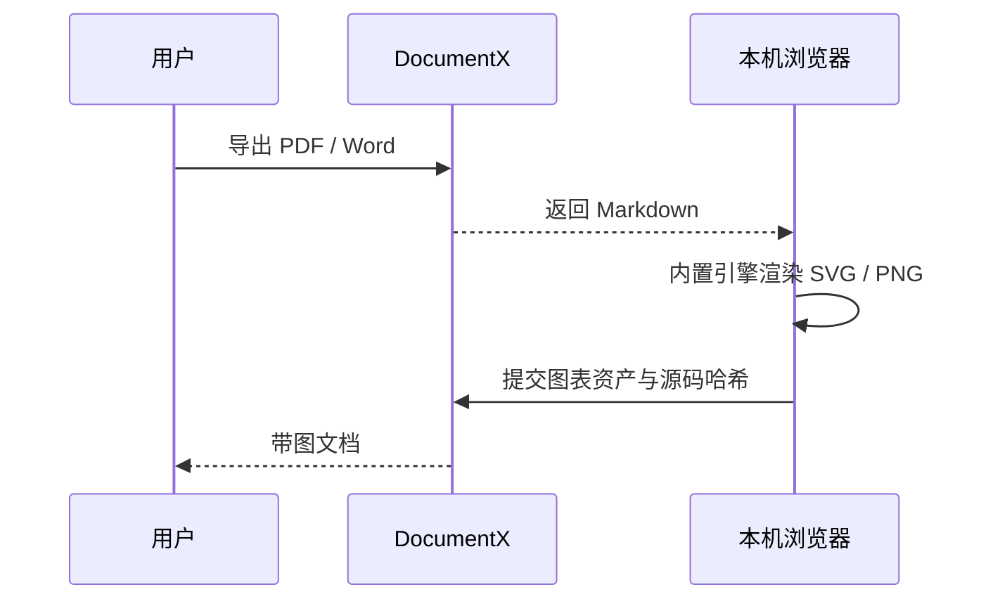

# DocumentX · 文档智能体

一个以网页服务形式对外提供的文档智能体：

- **对外**：网页问答，基于内部知识库回答；可把回答或按模板生成的文档导出为 **Markdown / PDF / Word** 下载。
- **对内**：把文档丢进 `knowledge/` 就成为知识库；把参考范例丢进 `templates/` 就成为输出模板。

## 架构

```
frontend/            前端（Vite + React + TypeScript）
backend/             后端（Rust + Axum）
  src/
    llm.rs           OpenAI Chat Completions 兼容客户端（流式 SSE）
    knowledge.rs     Retriever trait + 关键词检索（含中文 bigram）
    templates.rs     模板加载
    render/          Markdown → PDF / Word；图表统一渲染
    api.rs           HTTP 路由 / 中间件
knowledge/           ★ 内部文档（知识库）
templates/           ★ 对外输出模板（每个是一份参考范例 .md）
```

LLM 走 **OpenAI Chat Completions 协议**，`base_url` / `api_key` / `model` 全部可配置——
接 OpenAI 官方、自建网关或第三方模型都可以。

## 依赖

- Rust（stable）
- Node.js 18+

PDF / Word 导出无外部运行服务。PDF 使用**内嵌的 typst 库**，中文字体（Noto Sans SC）已打包进二进制；Word 导出还会把该字体嵌入 DOCX，接收方无需安装中文字体。
所以编译出的可执行文件零依赖，扔进任意 Linux 容器即可运行，无需安装 typst 或系统字体。

Mermaid、Graphviz（WASM）、Vega / Vega-Lite 图表引擎随前端产物打包并按需加载，不请求 CDN 或图表服务。

## 配置

```bash
cp config.example.toml config.toml   # 在仓库根目录，编辑 base_url / api_key / model
# 或用环境变量（见 .env.example），会覆盖 config.toml
```

> 配置里的相对路径（`knowledge`、`templates`、`frontend/dist`）都相对于**仓库根目录**，
> 因此下面的命令都在仓库根目录执行。

## 运行

**1. 构建前端**

```bash
cd frontend && npm install && npm run build && cd ..
```

**2. 从仓库根目录启动后端**（会同时托管前端产物）

```bash
cargo run --release --manifest-path backend/Cargo.toml
```

打开 http://localhost:8080

支持在 Markdown fenced code block 中使用：

- 首选：`mermaid`（流程、时序、状态、ER、类图、甘特图）
- 依赖关系：`graphviz` 或 `dot`
- 数据可视化：`vega`、`vegalite`

同一个代码块会在网页中显示为 SVG；导出时浏览器在一次解析中同步生成有序占位正文、经过清洗的 SVG 和 2x PNG，后端校验占位顺序、源码哈希与资产安全后，分别嵌入 PDF 和 Word，避免前后端重复解析 Markdown 产生数量偏差。Markdown 下载仍保留原始图表源码。所有渲染均在本机浏览器完成，外部 URL、脚本、事件属性和远程 Vega 数据会被拒绝。

示例：

````markdown

````

### 开发模式（前端热更新）

```bash
# 终端 A（仓库根目录）
cargo run --manifest-path backend/Cargo.toml
# 终端 B
cd frontend && npm run dev   # http://localhost:5173，/api 自动代理到 8080
```

## 打包发布成品

一键把二进制、前端、配置、知识库、模板、指令文件打进一个自包含的 `release/` 目录：

```bash
./scripts/package.sh
```

产出结构（可整个拷到服务器运行）：

```
release/
├── documentx        # 二进制
├── config.toml      # 配置（首次生成，之后你的修改会被保留）
├── AGENTS.md        # 指导 documentx 行为的指令（运行时作为系统提示加载）
├── knowledge/       # 知识库
├── templates/       # 模板
└── web/             # 前端产物
```

运行（首次先编辑 `release/config.toml` 填 LLM 端点）：

```bash
cd release && ./documentx     # 打开 http://localhost:8080
```

> `package.sh` 每次都会刷新二进制和 `web/`，但 `config.toml`、`AGENTS.md`、`knowledge/`、`templates/`
> 仅在首次生成时播种——你在 `release/` 里对配置和文档的修改，重新打包不会被覆盖。

### 两个 AGENTS.md 的区别

- **`AGENTS.md`（仓库根）**：给维护本项目的**编码智能体/开发者**看，描述架构与约定，程序不加载。
- **`release/AGENTS.md`（源文件在 `deploy/AGENTS.md`）**：**运行时**被 documentx 加载成系统提示，用来指导它的语气、事实纪律、产出规范。改完重启服务生效。

> ⚠️ 跨平台：Rust 编出的是平台相关原生二进制。在 Mac 上打包出的 `release/` 只能在 Mac(arm64) 跑；
> 要部署到 Linux 服务器，请在 Linux 上执行 `./scripts/package.sh`（或用 Docker 构建）。

## 已做的默认项优化

- **请求体上限**：axum 默认仅 2MB，已按 `max_body_mb` 显式放大（默认 16MB）。
- **压缩**：br + gzip，仅压缩 >1KB 的响应，且**对 SSE（text/event-stream）关闭**，不破坏流式。
- **超时**：非流式接口套整体超时；**流式聊天不套整体超时**，改用 reqwest 的 `read_timeout`（块间空闲超时），长回答不会被掐断。
- **连接池**：reqwest 复用连接（`pool_max_idle_per_host`）。
- **中文流式**：按字节缓冲、按行切分，避免多字节字符被 chunk 边界截断成乱码。
- **静态托管**：SPA 回退到 `index.html`。

## HTTP 接口

| 方法 | 路径 | 说明 |
|---|---|---|
| POST | `/api/chat` | 流式对话（SSE），body: `{ messages, use_knowledge }` |
| POST | `/api/generate` | 按模板+知识库生成并下载；网页端固定先请求 Markdown，再在本地渲染图表后调用 `/api/export` |
| POST | `/api/export` | 把 Markdown 导出为 md/pdf/docx，body: `{ content, format, title, diagrams }` |
| GET | `/api/templates` | 模板列表 |
| GET | `/api/knowledge` | 知识库文档列表 |
| GET | `/api/health` | 健康检查 |

`diagrams` 是与文中受支持代码块按顺序对应的图表资产数组。每项包含 `kind`、`source`、`source_hash`、`svg`、`png_base64`；网页客户端会把代码块同步替换为内部有序占位符，后端校验占位顺序和 SHA-256，PDF 只使用 SVG，Word 只使用 PNG。直接调用 API 的客户端也可继续提交原始 fenced code block，后端会解析并严格匹配资产；不含图表时可省略该字段。服务端不会为图表发起网络请求。

## 后续可扩展

- 关键词检索换向量检索（Qdrant，Rust 原生），只需实现同一个 `Retriever` trait。
- 知识库/模板热更新（当前为启动时加载）。
- 用户账号体系。
