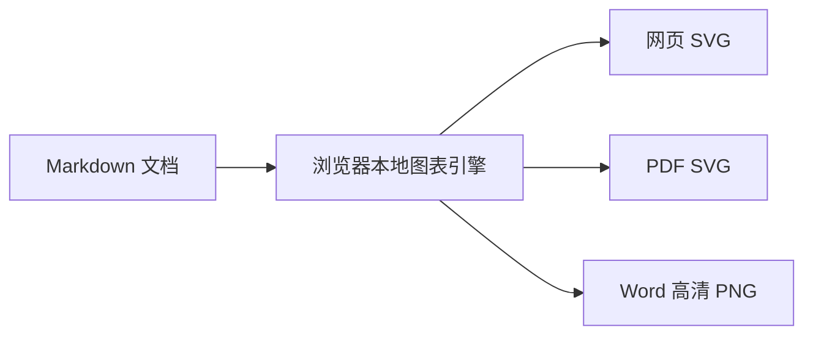
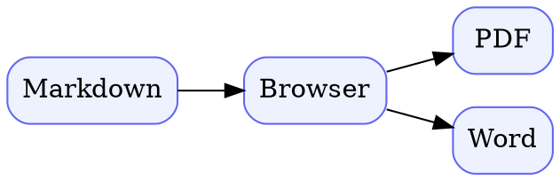

# DocumentX 技术图表使用指南

DocumentX 的图表引擎随网页打包，在浏览器本地运行，不会把图表源码或文档内容发送给图表服务。支持 Mermaid、Graphviz、Vega 和 Vega-Lite。网页预览使用 SVG；导出 PDF 时嵌入 SVG；导出 Word 时嵌入 2 倍分辨率 PNG，并把 Noto Sans SC 中文字体一并嵌入 DOCX。

## Mermaid：流程、时序、状态与关系图



## Graphviz：严格依赖关系图



## Vega-Lite：声明式数据图表

Vega 与 Vega-Lite 不允许使用外部 URL，数据必须直接写在 `values` 中。

```vegalite
{
  "$schema": "https://vega.github.io/schema/vega-lite/v5.json",
  "description": "各输出格式共享图表能力",
  "width": 420,
  "height": 220,
  "data": {
    "values": [
      {"format": "网页", "quality": 100},
      {"format": "PDF", "quality": 100},
      {"format": "Word", "quality": 100}
    ]
  },
  "mark": {"type": "bar", "cornerRadiusTopLeft": 5, "cornerRadiusTopRight": 5},
  "encoding": {
    "x": {"field": "format", "type": "nominal", "axis": {"title": "输出格式"}},
    "y": {"field": "quality", "type": "quantitative", "axis": {"title": "图表支持（%）"}},
    "color": {"value": "#6366F1"}
  }
}
```

## Vega：底层可视化语法

```vega
{
  "$schema": "https://vega.github.io/schema/vega/v5.json",
  "width": 420,
  "height": 80,
  "padding": 8,
  "data": [{"name": "table", "values": [{"label": "本地渲染", "value": 1}]}],
  "scales": [{"name": "x", "type": "linear", "domain": [0, 1], "range": "width"}],
  "marks": [{
    "type": "rect",
    "from": {"data": "table"},
    "encode": {"enter": {
      "x": {"value": 0}, "x2": {"scale": "x", "field": "value"},
      "y": {"value": 18}, "height": {"value": 36},
      "fill": {"value": "#22C55E"}, "cornerRadius": {"value": 8}
    }}
  }, {
    "type": "text",
    "from": {"data": "table"},
    "encode": {"enter": {
      "x": {"value": 210}, "y": {"value": 42},
      "align": {"value": "center"}, "baseline": {"value": "middle"},
      "text": {"field": "label"}, "fill": {"value": "white"},
      "fontSize": {"value": 16}, "fontWeight": {"value": "bold"}
    }}
  }]
}
```

## 安全与限制

- Mermaid 使用严格安全级别，禁用点击脚本和 HTML 标签。
- SVG 会删除脚本、事件属性、嵌入对象、外部图片和远程链接。
- Vega / Vega-Lite 禁止外部 URL，数据需内嵌。
- 单个图表源码默认不超过 256 KB，单篇文档默认不超过 32 个图表。
- Markdown 下载保留图表源码，便于版本管理和二次编辑。
